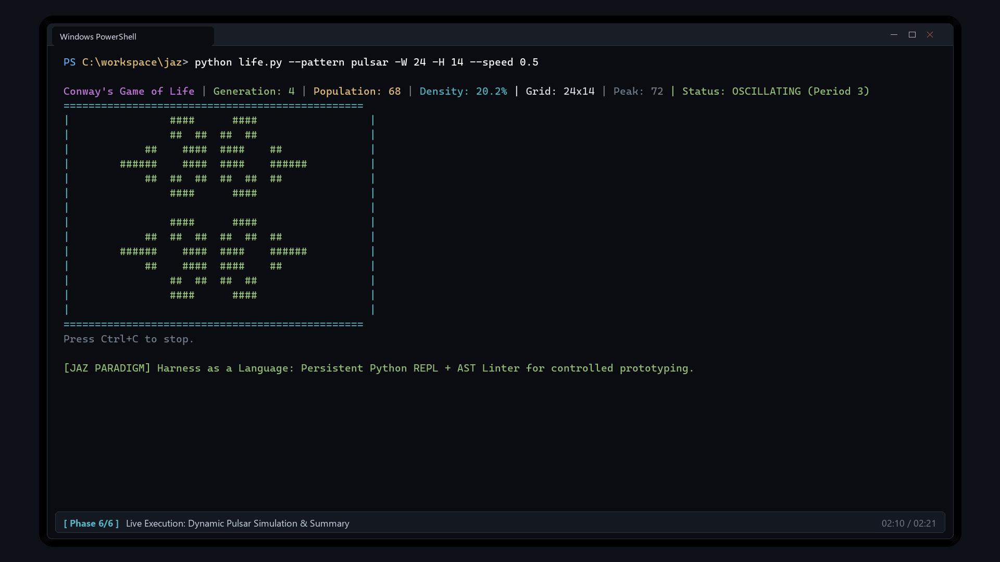

# JAZ: Harness as a Language

A minimalist, highly expressive LLM agent framework implementing the `invoke` primitive and dynamic scoping based on the research paper:

> **"Harness as a Language: A Minimalist Agent Framework With Maximal Expressivity"**  
> *Zhening Li, Joshua Liu, Mateja Vukelic, Nicole Shen, Supriya Lall, Amitayush Thakur, Alex Zhang, Omar Khattab, Jonathan Light, Armando Solar-Lezama (MIT CSAIL, 2026)*  
> [arXiv:2609.26891](https://arxiv.org/abs/2609.26891)

---

## Video Demonstration

Watch JAZ autonomously generating, testing, and self-repairing Python tools in real time:

https://github.com/dfcbear/harness_as_a_language_JAZ-Implementierung/raw/main/media/jaz_demonstration_en.mp4

[](https://github.com/dfcbear/harness_as_a_language_JAZ-Implementierung/raw/main/media/jaz_demonstration_en.mp4)

*Video Highlights (Full HD 1080p, 02:20 min):*
- **Autonomous Tool Synthesis & REPL Self-Repair**: Real 4-turn REPL trace generating an expert Sudoku generator & solver (`sudoku.py`, 393 lines). JAZ receives a traceback when a roundtrip test fails in turn 2, investigates the root cause, and autonomously fixes the test logic in turn 3.
- **`--linter` Architecture Deep Dive**: Pre-execution AST verification hook (`PythonLinterHook`) that analyzes code via `ast.parse()`, cleans formatting/markdown preambles, and protects the persistent REPL against state corruption.
- **Authentic Execution & Dynamic Simulation (`life.py`)**: Real execution trace creating Conway's Game of Life under active AST linter protection (8/8 unit tests pass in 33.7s), followed by dynamic terminal simulation of the period-3 Pulsar oscillator.
- Direct file: [`media/jaz_demonstration_en.mp4`](media/jaz_demonstration_en.mp4)

---

## Key Characteristics

1. **`invoke(**inputs)` as a Language Primitive**:  
   Instead of a rigid hardcoded harness, `invoke` acts as a function whose body is written by an LLM at runtime inside a Python REPL.
2. **Recursive Subagents by Default**:  
   Inside the REPL, `invoke` is available as a native Python function. The agent can spawn subagents using standard control flow (`for`, `if`, list comprehensions).
3. **Everything is a Variable**:  
   All named inputs, custom tools, data objects, and the interaction history itself (`__history__`) are live Python variables in the REPL.
4. **Tail-Recursive Delegation**:  
   When the context window fills up, the agent delegates remaining work to a fresh subagent while losslessly passing past history by reference (`prev_history = globals().get("prev_history", []) + __history__`).
5. **Universal Portability & Config**:  
   Self-contained copyable folder with zero heavy dependencies (only `httpx` and `rich`). Connects to any OpenAI-compatible API endpoint (self-hosted vLLM, Ollama, LM Studio, or cloud providers).
6. **Execution Modes**:
   - `direct`: Fast in-process execution.
   - `subprocess`: Isolated child process with filtered environment (API keys stripped) and workspace jail.
   - `container`: Strict isolation via Podman Desktop or Docker.

---

## Quickstart

### 1. Zero-Setup Start (Automatic Bootstrapping)
Run `run.py` directly. Required dependencies (`httpx`, `rich`) are automatically installed on first execution if missing:
```bash
python run.py "Calculate 42 * 2 and return the result"
```

Alternatively, install dependencies manually:
```bash
pip install -r requirements.txt
# or: pip install -e .
```

### 2. Configuration & API Keys
1. Copy `.env.example` to `.env` and set your credentials (protected by `.gitignore`):
   ```bash
   cp .env.example .env
   ```
2. The central configuration file `jaz.toml` dynamically references environment variables:
   ```toml
   [llm]
   base_url = "${JAZ_BASE_URL:-http://localhost:8000/v1}"
   model = "${JAZ_MODEL:-default}"
   api_key = "${JAZ_API_KEY:-EMPTY}"
   context_window = 32768
   temperature = 0.0

   [repl]
   sandbox = "direct"                      # "direct" | "subprocess" | "container"
   container_runtime = "podman"            # "podman" | "docker"
   ```

### 3. Verification
Verify connection to the configured LLM endpoint:
```bash
python -m jaz check
```

Run the unit test suite (deterministic, zero API cost):
```bash
pytest tests/unit
```

---

## Python API Usage

```python
from jaz import invoke, scope
from jaz.hooks import BudgetPool, IterationLimit, ReturnType

# Define any regular Python function as a tool
def search_database(query: str) -> list[str]:
    """Search internal records for keywords."""
    return [f"Record for {query}"]

# Dynamically scope tools and data to all invokes and sub-invokes
with scope(search_db=search_database):
    result = invoke(
        ReturnType(str),
        IterationLimit(15),
        task="Find records for server-01 and summarize findings.",
    )

print("Agent Result:", result)
```

---

## Terminal CLI Usage

```bash
# Basic task
python -m jaz run "Summarize system status"

# Pass inputs and load custom tools
python -m jaz run "Analyze customer churn" \
  -i threshold=0.15 \
  -f dataset=data.csv \
  -t my_tools.py \
  --sandbox subprocess \
  --max-iterations 25
```

During execution, the CLI displays a **live Rich dashboard** with invocation hierarchy, turn code, outputs, and token/cost counters. Every run automatically logs a streaming `events.jsonl` and `trajectory.json` in `runs/<run_id>/` for post-analysis or web dashboards.

---

## Detailed German Handbook

For a comprehensive guide on sandbox modes, security, self-hosted LLM configuration, and advanced patterns, see **[HANDBUCH.md](HANDBUCH.md)**.

---

## ToDo

Implement robust sandboxing.

---

## Citation & Acknowledgments

This framework is based on the paradigm introduced by the MIT CSAIL team. If you use JAZ in your research or applications, please cite the original authors:

```bibtex
@article{li2026jaz,
  title={Harness as a Language: A Minimalist Agent Framework With Maximal Expressivity},
  author={Li, Zhening and Liu, Joshua and Vukelic, Mateja and Shen, Nicole and Lall, Supriya and Thakur, Amitayush and Zhang, Alex and Khattab, Omar and Light, Jonathan and Solar-Lezama, Armando},
  journal={arXiv preprint arXiv:2609.26891},
  year={2026}
}
```

* Original Paper: [arXiv:2609.26891](https://arxiv.org/abs/2609.26891)
* Authors' Evaluation Repository: [jaz-evals (MIT CSAIL)](https://github.com/harness-as-a-language/jaz)
* PyPI Release: [`jaz-lang`](https://pypi.org/project/jaz-lang/)

---

## License

This project is open-source software licensed under the [MIT License](LICENSE).

